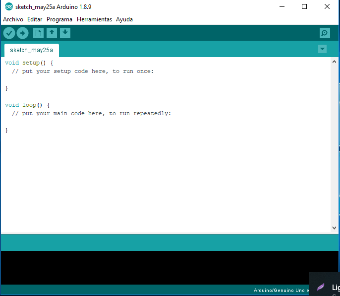
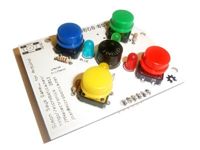

# Conceptos

- Software:
- Firmware:
- Hardware:
- Shield:
- Sensor:
- Actuador:
- IDE: Entorno

## Palabras clave (keywords)

# Introducción y Justificación.

## Contextualizacion

El trabajo que se presenta a continuación, pretende dar a conocer los recursos didácticos que ofrece las herramientas de apoyo a los dispositivos conocidos como Arduino, que están actualmente en tendencia, con el fin de aportar una ayuda extra en la enseñanza de uno de los bloques existente en la asignatura de Tecnología, y en vista a otras que están surgiendo en los últimos tiempos.

Enfocado desde un punto de vista innovador, este trabajo se desarrolla a través de una metodología de investigación, estudiando el método de enseñanza actual, su alcance y contenidos, buscando artículos tecnológicos actuales para conocer los útiles adaptables a la enseñanza, y proponiendo, en vista al curso de la sociedad, nuevas herramientas que ayuden al profesor a realizar una nueva unidad didáctica, y a los alumnos a alcanzar con mayor facilidad los conocimientos que pretenden transmitir.

Para completar el estudio, se propone un ejemplo de unidad didáctica con uno de los hallazgos encontrados: el entrenador _Open Smart Rich Shield_, que se expondrá a lo largo de trabajo.

Se concluye el estudio compartiendo una propuestas alternativas al conocido Arduino, más nuevo y más versátil: el _Espduino_.

## Motivación

Debido a los rápidos avances de los últimos años, existe una ola que se viene encima de forma inminente. Se habla de una nueva revolución de las máquinas [1], robots que suplirán a los seres humanos en los trabajos [2] y [3], ayudantes virtuales que nos escuchan en todo momento [4], entre otros muchos. Pero los avances más interesantes desde el punto de vista educativo confluyen en la digitalización, en el uso de las herramientas tecnológicas que están al alcance de todos.

Como se puede apreciar, el avance en útiles electrónicos no para de crecer y multiplicarse. _Internet Of Things_, _Industria 4.0_, _Smart Cities_, todas ellas tienen un mismo denominador común: sensores comunicados entre sí, capturando información y actuando según las mentes pensantes hayan programado.

Ninguno de estos conceptos son nada nuevo, los sensores y actuadores llevan existiendo ya muchos años, pero si es cierto que nunca han estado tan cerca de la vida en el día a día. Y si bien no es alcance de todos desarrollar estos productos, sí es de gran importancia conocer una base, cómo funcionan, y qué se puede hacer con ellos.

Es aquí donde se presenta la propuesta de enseñanza, descubrir cómo funcionan estos dispositivos (programación electrónica) y qué pueden llegar a hacer (sensores y actuadores), de una forma fácil, atractiva y visual.

## Objetivo principal: presentar una propuesta basada en investigación

La realización de las prácticas asociadas al máster de este trabajo estuvo contextualizada en una clase de 3º de la ESO, impartiendo el módulo 5 de la asignatura de Tecnología. Este trabajo nace de buscar mejorar la enseñanza en este tema.

A pesar de proponer una mejora didáctica, el trabajo que se expone es orientado a investigación. Esta decisión fue tomada condicionado a la dificultad de plantear estas propuestas en las prácticas, debido a que las fiestas entre el segundo y tercer trimestre fueron tardías y trajo como consecuencia un tiempo muy ajustado para cumplir con los contenidos, sin dar margen a actividades extraordinarias.

Es por ello que se busca plantear una mejora en la didáctica, de forma teórica, con el objetivo de poner en práctica y hacer un posterior estudio si los resultados reales concuerdan con los propuestos.

# Estado del arte

## Educación actual

	- Programación y la educación
		[7] Ejemplo de proyecto semaforo oficial por la junta de educacion de Galicia
	- Realmente Arduino mejora la educacion ?
		[X] 3 PDF que lo demuestran
	- Hay otras alternativas ?
		- si ! las shield

## Arduino

**¿Qué es Arduino?**

Según la página oficial [6], _Arduino_ es una plataforma electrónica cuyo código fuente está abierto, con el fin de ofrecer un uso conjunto de Software y Hardware de manera sencilla. Esta placa electrónica tiene la capacidad de leer entrada de datos, desde algo tan simple como una señal digital que es activada cuando se pulsa un botón, como una señal analógica con 1024 puntos de precisión en un sensor de luz, hasta recibir un mensaje de Twitter; y provocar una salida programada o en respuesta a esta entrada también con una señal digital o analógica que nos permite encender y apagar un motor o un LED variando su intensidad, o publicar un contenido en una plataforma online.

Estos comportamientos pueden ser programados sin necesidad de ningún componente extra, como suele ser común en la programación de microcontroladores la necesidad de un dispositivo programador que cargue el Firmware. Arduino ya incorpora en la propia placa un programador, y tan solo conectándolo a un ordenador podremos, de manera muy sencilla, definir estos patrones de entrada y salida en el microcontrolador, en definitiva, decir qué hacer a través del entorno de desarrollo de Arduino y otros programas más sencillos que lo gestionan.

**¿Por qué Arduino?**

[6] Arduino nació de la idea de diseñar una herramienta para la construcción de prototipos de manera rápida y sencilla, orientado, principalmente, para estudiantes que no tuvieran experiencia en electrónica ni programación. Tan pronto como el equipo que lo desarrollaba comenzó a crecer, Arduino empezó a sufrir cambios para adaptarse a nuevos retos y proyectos.

Todas las placas Arduino son completamente de código abierto, lo que permite a los usuarios adaptarlas a sus necesidades particulares. El software también es de código abierto y está creciendo a través de las contribuciones de los usuarios de todo el mundo. Todo este conjunto han dado lugar a la gran cantidad de recursos disponibles de forma gratuita y totalmente accesible.

El hecho de que Arduino sea de código abierto, ha permitido que se expanda con gran rapidez, tanto a nivel de desarrollo, como a nivel comercial, pues debido a esta condición, los precios de este dispositivo y sus componentes son muy bajos. Y aunque originalmente surgió con intenciones didácticas y de investigación, actualmente lo utilizan todo tipo de personas en diferentes ámbitos: educativo, arte, programación, profesional o sólo por entretenimiento.

## Shields

**¿Qué es una Shield?**

Una _shield_ es un circuito modular que se monta encima de otros circuitos, cuentan con el número de pines exactos de los que posee Arduino, distribuidos en las mimas posiciones, de manera que encajan a la perfección formando un solo bloque, tapando la parte superior del microcontrolador. Este módulo complejo suele ir orientado a una finalidad concreta, existen muchos tipos de shield aportando una funcionalidad extra. [8] Se muestran algunos ejemplos a continuación:

Existen shield que tienen una funcionalidad única muy concreta como las que se acaban de mostrar, otras en cambio, las llamadas Shield multifunción, están preparadas como un banco de pruebas, con múltiples funcionalidades y componentes de diversos tipos. Estas shield también son conocidas como _entrenadores_, pues están orientadas a realizar pruebas y prototipos a través un mismo dispositivo genérico, es decir, a entrenar los conocimientos.

Buscando un objetivo didáctico generalizado, en el que probar muchos tipos de actuadores y sensores, estas shield multifunción aportan mucho valor al trabajo, el cual se centrará en la _Open Smart Rich Shield_ que tiene un buen aspecto visual y se compone de sensores y actuadores de sencillo pero de muy extendido uso, como pueden ser botones, pantallas, LED, altavoz Buzzer o un sensor de luz.

En los próximos apartados se detallarán en profundidad las características, funcionalidad y usos de este entrenador.

## Similares propuestas

	- TFG
	- La practica de programacion con la otra shield, comparativa y porque es mejor la Open Smart Rich Shield

	- Tendencias actuales (TIC, robotica, digitalización) : Referenciar noticias actuales
		- Igual reescribir la motivación y poner eso aqui, dependiendoq ue se encuentre, quizá aqui más en el entorno educativo
	- Metodo de enseñanza: gamificacion
	- Que hay similar a lo que propongo y que han hecho otros
	- De las placas, algo tecnológico

# Planteamiento del problema

Desde hace ya algún tiempo se conoce la necesidad de un cambio en la estructura de la enseñanza, todo debido a los rápidos cambios la forma de vivir con la entrada de la informática, cuya explosión se produjo con la entrada de los smartphones, que nos capacitó a transportar un dispositivo de cálculo avanzado casi las 24 horas de todos los días del año.

Con estos cambios, surge la necesidad de nuevos conocimientos, y por ende, nuevas enseñanzas para preparar dicho saber. Es por ello que aparecen nuevos bloques en la asignatura de tecnología, que intentan hacer aparecer estos conocimientos en el temario, pero con poco protagonismo, manteniendo la misma estructura, apretando más en tiempo los contenidos a enseñar para poder abarcar todos lo que acontece a esta materia.

El método actual de enseñanza de la programación en esta asignatura, es a través de bloques, con la animación de objetos visuales, como es el caso de Scratch. Cuando se pretende ir más allá, por tocar algo físico, que el alumno manipule con sus manos, es cuando entramos en el mundo Hardware. Este campo nos ofrece una infinidad de posibilidades, y es por ello habrá de buscar la manera más sencilla de abordar todas estas riquezas de las que disponemos.

Aunque se detalle en otro apartado del trabajo, si es conveniente adelantar e ir entendiendo que es contraproducente exigir unos conocimientos previos para explicar un concepto nuevo, que no tiene que ver con este conocimiento requerido. Y que si bien no son complejos, pueden dificultar la adquisición de los que realmente se pretenden transmitir, esto es, concretamente, mezclar el montaje de un circuito junto con la programación de un microcontrolador que interactúe frente a él. Este trabajo busca lograr superar esta adversidad de querer utilizar todo el potencial sin obstaculizar el aprendizaje.

Este trabajo da un apoyo a esta futura materia y didáctica que aún no está regularizada, pero que cada vez cobra más importancia.

# Fundamentación teórica

Lo siguientes datos se dan atendiendo a la Orden del 14 de Julio de 2016 del Boletín Oficial de la Junta de Andalucía (BOJA).

En la asignatura de Tecnología Aplicada de 1º de la ESO, existe un bloque de iniciación a la programación, orientado de manera gráfica y con el uso de programación con bloques

> Bloque 3: Iniciación a la programación.

En la asignatura de Tecnología de 2º y 3º de la ESO se encuentran dos bloques intrínsecamente relacionados, de hecho, la existencia de uno justifica la del otro, es así como se plantea el bloque 5 como conocimientos introductorios al bloque 6

> Bloque 5. Iniciación a la programación y sistemas de control.

> Bloque 6. Tecnologías de Información y la Comunicación.

Analizando los contenidos de dichos bloques, se puede realizar un símil en relación a los contenidos que conciernen a este trabajo. En el bloque 5 se busca enseñar las bases de la programación: qué es un programa, qué son instrucciones, qué son los elementos de control, etc. para posteriormente, en el bloque 6, tener un ligero conocimiento de cómo funcionan las herramientas que se van a utilizar. Entre ellas, entra en contenido los periféricos (ratón, teclado, etc.), que podemos entender como unos dispositivos que intercambian información entre PC y los usuarios frente a una actividad por parte de uno de estos extremos. Que es, en un contexto distinto, lo que entendemos como sensores y actuadores.

Buscando afianzar mejor estos términos, y llevar un poco más allá los conocimientos, buscamos desarrollar una parte del programa del bloque 5:

> Introducción a los sistemas automáticos cotidianos: sensores, elementos de control y actuadores.

Se busca por tanto, mejorar el aprendizaje de los alumnos sobre programación y aplicación diversos sistemas, a través del uso de un entrenador o _shield_ que esté compuesto de sensores y actuadores sencillos, visuales y atractivos. No importa que sea un LED o una bombilla, un botón o muchos botones como en un teclado, una pantalla de 7 segmentos de 4 dígitos o una pantalla LCD como la del portátil; lo importante es ver que la información entra y sale del dispositivo.

# Preguntas de investigación

	- A que he dado respuestas en este trabajo

	- ¿Cómo facilitar el aprendizaje de la programación?
	- ¿Cómo motivar e interesar por la electrónica?
	- ¿Cómo explicar sensores y actuadores?
	- ¿Qué herramientas tenemos disponibles?
		- Componentes sueltos
		- Modulos
		- Shield Multifunción

# Objetivos

	- Desglosar objetivo principal en secundarios en lista 

# Metodología y desarrollo de la investigación

La idea y desarrollo de esta investigación comienza en la realización de las prácticas asociadas a los estudios referentes a este Trabajo Fin de Máster, en las cuales se detectaron ciertas oportunidades de mejoras en la metodología didáctica que se aplicaba. Esta mejora se centra en eliminar aquellas dificultades que no forman parte del contenido del bloque a impartir, y que limitan a los alumnos a centrarse en la parte que se quiere enseñar.

Este bloque es el ya especificado en el apartado de objeto de estudio de este mismo documento, cuyo programa cual comprende los contenidos de:

- Programación gráfica por bloques de instrucciones.
- Entorno de programación.
- Bloques de programación.
- Control de flujo de programa.
- Interacción con el usuario y entre objetos.
- Introducción a los sistemas automáticos cotidianos: sensores, elementos de control y actuadores.
- Control programado de automatismos sencillos.

Una vez el problema ha sido detectado, se procede a realizar un estudio de la situación actual, esto es, buscar la situación actual de la educación y las últimas tendencias tecnológicas a través de noticias y artículos de investigación recientes.

En este paso, se han encontrado noticias de los últimos avances en robótica y artículos que detallan cómo Arduino ha demostrado mejorar los resultados académicos en secundaria y la universidad. Esto demuestra por un lado, la necesidad de dar a conocer estos conocimientos, y por otro lado, la viabilidad de aplicar esta enseñanza con la herramienta Arduino.

Una vez en claro qué enseñar y cómo enseñarlo, se pasa a buscar soluciones a las debilidades actuales de esta enseñanza, a través de diferentes metodologías y herramientas que usar. Con esta búsqueda se encuentra los componentes llamados "shield" o escudos, que aportan el punto clave a esta dificultad: eliminar el montaje del circuito electrónico en la programación con Arduino. Y el estudio pasa a buscar qué tipos de shield existen y cuáles son de interés didáctico, encontrando así, las shield multifunción, que montan muchos y diversos componentes en un solo módulo compacto y de sencillo uso.

Con este hallazgo concluimos el periodo de búsqueda de soluciones para dar paso al estudio y desarrollo de una unidad didáctica con las herramientas disponibles, tanto Software:

- Visualino
- mBlock
- Scratch 4 Arduino
- Snap 4 Arduino
- ArduinoBlocks

Como Hardware, a saber, las distintas shield que ya se han mostrado con anterioridad, y la escogida _Open Smart Rich Shield_ con la que se desarrollarán las actividades de ejemplo propuestas en esta unidad didáctica.

# Objeto de estudio

	- Que es programación
	- Que son sensores y actuadores
	- Hablar sobre Open Smart Rich Shield
		- Componentes

# Desarrollo de la unidad didáctica

## Descripción: 

	- tema o el nombre de la unidad didáctica
	- las actividades de motivación

## Temporización:

	- 2 bloques por trimestre --> 1 mes y medio (Medio trimestre)
	- número de sesiones y el momento en el que se pondrá en práctica.

## Competencias

- **CCL** Comunicación lingüística.
	- Leer, interpretar y redactar informes y documentos técnicos.
	- Adquirir el vocabulario específico del área.
	- Exponer en público los trabajos desarrollados
- **CMCT**: Competencia Matemática y competencias básicas en Ciencia y Tecnología.
	- Conocer y manejar objetos, procesos, sistemas y entornos tecnológicos,
	- Resolver problemas en los que sea preciso aplicar expresiones matemáticas, referidas a principios y fenómenos físicos, que resuelven problemas prácticos del mundo material.
	- Medir y calcular magnitudes básicas, empleando rigurosamente el lenguaje matemático.
	- Leer e interpretar gráficos empleando con rigurosidad el lenguaje matemático.
	- Utilizar escalas.
	- Analizar objetos y sistemas técnicos
- **CD**: Competencia Digital.
	- Procesar, elaborar, almacenar, compartir, publicar y presentar información, empleando diversas herramientas informáticas como Internet, calculadoras científicas o gráficas, ordenadores, programas informáticos, etc., que permitan calcular, representar gráficamente, hacer tablas, procesar textos, simular modelos, etc.
	- Utilizar los medios interactivos de forma responsable.
	- Trabajar con entornos de programación analizando, modificando y ejecutando programas.
	- Resolver problemas empleando sistemas digitales.
	- Analizar características y funcionalidades de los sistemas de comunicación digitales actuales.
- **CAA**: Competencia Aprender a Aprender.
	- Resolver problemas tecnológicos empleando el método de proyectos: buscando y seleccionando información, desarrollando ideas, planificando y ejecutando un proyecto, evaluándolo y aportando propuestas de mejora.
	- Tener iniciativa en la toma de decisiones, espíritu de superación, perseverancia ante las dificultades, autonomía y autocrítica.
	- Razonar y buscar respuestas de forma autónoma ante diversas situaciones.
	- Ser consciente de los conocimientos obtenidos a través de la autoevaluación.
- **CSC**: Competencia Social y Cívica.
	- Trabajar en equipo: Discutiendo ideas y razonamientos, escuchando a los demás y gestionando conflictos, adoptando actitudes de respeto y tolerancia.
	- Analizar el impacto del desarrollo tecnológico y su influencia en los cambios económicos y de organización social que han tenido lugar a lo largo de la historia de la humanidad.
	- Valorar el uso responsable de los recursos naturales.
	- Fomentar actitudes responsables de consumo nacional.
- **SIEP**: Sentido de la Iniciativa y espíritu Emprendedor.
	- Resolver problemas tecnológicos en los proyectos, teniendo iniciativa en la toma de decisiones, espíritu de superación, perseverancia ante las dificultades, autonomía y autocrítica.
- **CEC**: Conciencia y expresiones culturales. 
	- Valorar el aspecto estético, la elección y tratamiento de materiales en el desarrollo de proyectos que impliquen el diseño y construcción de objetos y en aquellas actividades de investigación que permiten conocer cómo han contribuido las ciencias y la tecnología al desarrollo del patrimonio industrial, cultural y artístico de la humanidad, y en especial al de nuestra comunidad.

## Objetivos de etapa

### 1 Objetivos generales

Se presentan los objetivos generales de la Educación Secundaria Obligatoria que aparecen en el Real Decreto 1105/2014, de 26 de diciembre, que son alcanzados a través de la unidad didáctica propuesta. Esta contribuirá a desarrollar en los alumnos y las alumnas las capacidades que les permitan:

1. Asumir responsablemente sus deberes, conocer y ejercer sus derechos en el respeto a los demás, practicar la tolerancia, la cooperación y la solidaridad entre las personas y grupos, ejercitarse en el diálogo afianzando los derechos humanos y la igualdad de trato y de oportunidades entre mujeres y hombres, como valores comunes de una sociedad plural y prepararse para el ejercicio de la ciudadanía democrática.

2. Desarrollar y consolidar hábitos de disciplina, estudio y trabajo individual y en equipo como condición necesaria para una realización eficaz de las tareas del aprendizaje y como medio de desarrollo personal.

3. Valorar y respetar la diferencia de sexos y la igualdad de derechos y oportunidades entre ellos. Rechazar la discriminación de las personas por razón de sexo o por cualquier otra condición o circunstancia personal o social. Rechazar los estereotipos que supongan discriminación entre hombres y mujeres, así como cualquier manifestación de violencia contra la mujer.

4. Fortalecer sus capacidades afectivas en todos los ámbitos de la personalidad y en sus relaciones con los demás, así como rechazar la violencia, los prejuicios de cualquier tipo, los comportamientos sexistas y resolver pacíficamente los conflictos.

5. Desarrollar destrezas básicas en la utilización de las fuentes de información para, con sentido crítico, adquirir nuevos conocimientos. Adquirir una preparación básica en el campo de las tecnologías, especialmente las de la información y la comunicación.

6. Concebir el conocimiento científico como un saber integrado, que se estructura en distintas disciplinas, así como conocer y aplicar los métodos para identificar los problemas en los diversos campos del conocimiento y de la experiencia.

7. Desarrollar el espíritu emprendedor y la confianza en sí mismo, la participación, el sentido crítico, la iniciativa personal y la capacidad para aprender a aprender, planificar, tomar decisiones y asumir responsabilidades.

8. Comprender y expresar con corrección, oralmente y por escrito, en la lengua castellana y, si la hubiere, en la lengua cooficial de la Comunidad Autónoma, textos y mensajes complejos, e iniciarse en el conocimiento, la lectura y el estudio de la literatura.

9. Comprender y expresarse en una o más lenguas extranjeras de manera apropiada.

### 2 Objetivos generales del área de tecnología

La Orden de currículo establece, asimismo, que los objetivos Generales del área de Tecnología en la Educación Secundaria Obligatoria deben entenderse, como aportaciones que, desde el área, contribuyen a la consecución de los objetivos generales de la etapa, anteriormente expuestos.

1. Abordar con autonomía y creatividad, individualmente y en grupo, problemas tecnológicos trabajando de forma ordenada y metódica para estudiar el problema, recopilar y seleccionar información procedente de distintas fuentes, elaborar la documentación pertinente, concebir, diseñar, planificar y construir objetos o sistemas que resuelvan el problema estudiado y evaluar su idoneidad desde distintos puntos de vista.

2. Disponer de destrezas técnicas y conocimientos suficientes para el análisis, intervención, diseño, elaboración y manipulación de forma segura y precisa de materiales, objetos y sistemas tecnológicos.

3. Analizar los objetos y sistemas técnicos para comprender su funcionamiento, conocer sus elementos y las funciones que realizan, aprender la mejor forma de usarlos y controlarlos y entender las condiciones fundamentales que han intervenido en su diseño y construcción.

4. Expresar y comunicar ideas y soluciones técnicas, así como explorar su viabilidad y alcance utilizando los medios tecnológicos, recursos gráficos, la simbología y el vocabulario adecuados.

5. Adoptar actitudes favorables a la resolución de problemas técnicos, desarrollando interés y curiosidad hacia la actividad tecnológica, analizando y valorando críticamente la investigación y el desarrollo tecnológico y su influencia en la sociedad, en el medio ambiente, en la salud y en el bienestar personal y colectivo.

6. Comprender las funciones de los componentes físicos de un ordenador y dispositivos de proceso de información digitales, así como su funcionamiento y formas de conectarlos. Manejar con soltura aplicaciones y recursos TIC que permitan buscar, almacenar, organizar, manipular, recuperar, presentar y publicar información, empleando de forma habitual las redes de comunicación.
7. Resolver problemas a través de la programación y del diseño de sistemas de control.
8. Asumir de forma crítica y activa el avance y la aparición de nuevas tecnologías, incorporándolas al quehacer cotidiano.
9. Actuar de forma dialogante, flexible y responsable en el trabajo en equipo para la búsqueda de soluciones, la toma de decisiones y la ejecución de las tareas encomendadas con actitud de respeto, cooperación, tolerancia y solidaridad.

### 3 Objetivos específicos de la unidad didáctica

En particular, en el desarrollo de esta unidad didáctica se establecen los siguientes objetivos:

1. Instalar y configurar la tarjeta controladora Arduino en un ordenador.
2. Instalar y configurar el IDE de Arduino en el ordenador.
3. Explotar recursos de Internet a través del navegador web.
4. Identificar componentes de una placa electrónica.
5. Comprender el funcionamiento de sensores y actuadores.
6. Conocer y aplicar el uso de Arduino.
7. Aprender a cargar un Firmware en Arduino.
8. Conocer los elementos de un código de programación.
9. Programar el controlador a través de la plataforma ArduinoBlocks.
10. Conocer diversos algoritmos sencillos cotidianos.
11. Identificar y manipular las partes de un código de programación.

## Requisitos previos

1. Conocimientos sobre conceptos básicos informáticos.
2. Conocimientos y manipulación de periféricos del ordenador.
3. Conocimientos de instalación software en ordenador.
4. Conocimientos básicos de navegación en Internet.
5. Conocimientos básicos de electricidad y electrónica.
6. Conocimientos sobre componentes electrónicos.
7. Conocimientos básicos de lógica de programación.

## Contenidos de aprendizaje:

### Uso de los componentes

#### Actividad "Conociendo el entrenador o shield"

**Bloques relacionados:** 1, 2, 4, 5 y 6

**Objetivos de etapa:** 1, 2, 3.1, 3.3, 3.4, 3.5, 3.6, 3.7 

**Criterios de evaluación:** `Aqui enumerar los objetivos`

**Requisitos previos**

**Descripción**

Instalación y puesta a punto del Arduino junto con la Open Smart Rich Shield, conociendo e identificando cada una de los componentes de la placa y grabando Firmware dado a Arduino.

**Solución propuesta**

#### Actividad "LED"

**Bloques relacionados:** 1, 2, 4, 5 y 6

**Objetivos de etapa:** 1, 2, 3.3, 3.4, 3.5, 3.6, 3.7, 3.9

Conocer qué es un LED

**Criterios de evaluación**

**Requisitos previos**

**Descripción**

- Que es un LED (actuador analógico y digital [solo lo usamos como digital])
- Como se programa

**Solución propuesta**

#### Actividad "Pulsador"

**Bloques relacionados:** 1, 2, 4, 5 y 6

**Objetivos de etapa:** 1, 2, 3.3, 3.4, 3.5, 3.6, 3.7, 3.9

Conocer que es un pulsador

**Criterios de evaluación**

**Requisitos previos**

**Descripción**

- Que es un pulsador (sensor digital)
- Como se programa

**Solución propuesta**

#### Actividad "Zumbador"

**Bloques relacionados:** 1, 2, 4, 5 y 6

**Objetivos de etapa:** 1, 2, 3.3, 3.4, 3.5, 3.6, 3.7, 3.9

Aprender que es un zumbador

**Criterios de evaluación**

**Requisitos previos**

**Descripción**

- Que es un zumbador (actuador en pin digital)
- Como se programa

**Solución propuesta**

#### Actividad "Potenciómetro"

**Bloques relacionados:** 1, 2, 4, 5 y 6

**Objetivos de etapa:** 1, 2, 3.3, 3.4, 3.5, 3.6, 3.7, 3.9

**Criterios de evaluación**

**Requisitos previos**

**Descripción**

- Que es un potenciometro (sensor analógico)
- Como se programa

**Solución propuesta**

#### Actividad "Fotoresistencia o LDR"

**Bloques relacionados:** 1, 2, 4, 5 y 6

**Objetivos de etapa:** 1, 2, 3.3, 3.4, 3.5, 3.6, 3.7, 3.9

**Criterios de evaluación**

**Requisitos previos**

**Descripción**

- Que es una fotoresistencia, un sensor de luz (sensor analógico)
- Como se programa

**Solución propuesta**

#### Actividad "Termistor o NTC"

**Bloques relacionados:** 1, 2, 4, 5 y 6

**Objetivos de etapa:** 1, 2, 3.3, 3.4, 3.5, 3.6, 3.7, 3.9

**Criterios de evaluación**

**Requisitos previos**

**Descripción**

- Que es una termistor, un sensor de temperatura (sensor analógico)
- Como se programa

**Solución propuesta**

#### Actividad "Display 7 Segmentos" [avanzada]

**Bloques relacionados:** 1, 2, 4, 5 y 6

**Objetivos de etapa:** 1, 2, 3.2, 3.3, 3.4, 3.5, 3.6, 3.7, 3.9, 3.11

**Criterios de evaluación**

**Requisitos previos**

**Descripción**

- Que es una pantalla de 7 segmentos (se compone de varios LED)
- Como funciona
- Como se programa
	- Como se incluye una librería

**Solución propuesta**

#### Actividad "Componente DHT11" [avanzada]

**Bloques relacionados:** 1, 2, 4, 5 y 6

**Objetivos de etapa:** 1, 2, 3.2, 3.3, 3.4, 3.5, 3.6, 3.7, 3.9, 3.11

**Criterios de evaluación**

**Requisitos previos**

**Descripción**

**Solución propuesta**

#### Actividad "Receptor infrarrojos" [avanzada]

**Bloques relacionados:** 1, 2, 4, 5 y 6

**Objetivos de etapa:** 1, 2, 3.2, 3.3, 3.4, 3.5, 3.6, 3.7, 3.9, 3.11

**Criterios de evaluación**

**Requisitos previos**

**Descripción**

- Introducción a transmisores (actuadores) y receptores (sensores)
- Como funciona
- Como se programa
	- Como se incluye una librería

**Solución propuesta**

### Actividades básicas

#### Actividad "Semáforo"

**Bloques relacionados:** 1, 2, 4, 5 y 6

**Objetivos de etapa:** 1, 2, 3.3, 3.4, 3.5, 3.6, 3.7, 3.8, 3.9, 3.10 3.11

**Criterios de evaluación**

**Requisitos previos**

**Descripción**

Extra:
	- Añadir pulsador
	- Añadir sonido intermitente cuando esta verde

**Solución propuesta**

#### Actividad "Selector de luces"

**Bloques relacionados:** 1, 2, 4, 5 y 6

**Objetivos de etapa:** 1, 2, 3.3, 3.4, 3.5, 3.6, 3.7, 3.8, 3.9, 3.10 3.11

**Criterios de evaluación**

**Requisitos previos**

**Descripción**

Se trata de conmutar los leds según la posición del potenciómetro

**Solución propuesta**

#### Actividad "Detector de luminosidad"

**Bloques relacionados:** 1, 2, 4, 5 y 6

**Objetivos de etapa:** 1, 2, 3.3, 3.4, 3.5, 3.6, 3.7, 3.8, 3.9, 3.10 3.11

**Criterios de evaluación**

**Requisitos previos**

**Descripción**

Detectar cuando se tape el arduino

**Solución propuesta**

#### Actividad "Reproductor de sonidos"

**Bloques relacionados:** 1, 2, 4, 5 y 6

**Objetivos de etapa:** 1, 2, 3.3, 3.4, 3.5, 3.6, 3.7, 3.8, 3.9, 3.10 3.11

**Criterios de evaluación**

**Requisitos previos**

**Descripción**

Pulsar un botón y reproducir un sonido. La frecuencia la marcará el valor del potenciómetro

**Solución propuesta**

### Actividades avanzadas

#### Actividad "Reproducir de sonidos"

**Bloques relacionados:** 1, 2, 4, 5 y 6

**Objetivos de etapa:** 1, 2, 3.2, 3.3, 3.4, 3.5, 3.6, 3.7, 3.8, 3.9, 3.10 3.11

**Criterios de evaluación**

**Requisitos previos**

**Descripción**

**Solución propuesta**

#### Actividad "Contador con pantalla"

**Bloques relacionados:** 1, 2, 4, 5 y 6

**Objetivos de etapa:** 1, 2, 3.2, 3.3, 3.4, 3.5, 3.6, 3.7, 3.8, 3.9, 3.10 3.11

**Criterios de evaluación**

**Requisitos previos**

**Descripción**

**Solución propuesta**

#### Actividad "Caja de música"

**Bloques relacionados:** 1, 2, 4, 5 y 6

**Objetivos de etapa:** 1, 2, 3.2, 3.3, 3.4, 3.5, 3.6, 3.7, 3.8, 3.9, 3.10 3.11

**Criterios de evaluación**

**Requisitos previos**

**Descripción**

**Solución propuesta**

#### Actividad "Caja de música por infrarrojos"

**Bloques relacionados:** 1, 2, 4, 5 y 6

**Objetivos de etapa:** 1, 2, 3.2, 3.3, 3.4, 3.5, 3.6, 3.7, 3.8, 3.9, 3.10 3.11

**Criterios de evaluación**

**Requisitos previos**

**Descripción**

**Solución propuesta**

#### Actividad "Control de velocidad de canción"

**Bloques relacionados:** 1, 2, 4, 5 y 6

**Objetivos de etapa:** 1, 2, 3.2, 3.3, 3.4, 3.5, 3.6, 3.7, 3.8, 3.9, 3.10 3.11

**Criterios de evaluación**

**Requisitos previos** 

**Descripción**

**Solución propuesta**

## Metodología

	- Cómo se va a enseñar
	- Atención a la diversidad

## Recursos materiales:

- Recursos generales:
	- Proyector
	- Aula con ordenadores
	- Necesario un ordenador por cada pareja de alumnos
- Recursos por alumno:
	- Arduino UNO
	- Cable USB
	- Shield Multifunción
- Recursos software:
	- Driver de Arduino
	- IDE de Arduino
	- Software de programación de alto nivel. Alternativas:
		- Visualino
		- Arduinoblock (online)
		- Scratch 4 Arduino
		- mBlock

## Evaluación: criterios e indicadores de la valoración de los aprendizajes de los alumnos

Según la Orden del 14 de Julio de 2016 del Boletín Oficial de la Junta de Andalucía, se establecen:

**Criterios de evaluación**

1. Conocer y manejar un entorno de programación distinguiendo sus partes más importantes y adquirir las habilidades y los conocimientos necesarios para elaborar programas informáticos sencillos utilizando programación gráfica por bloques de instrucciones. CD, CMCT, CAA, CCL, SIEP.
2. Analizar un problema y elaborar un diagrama de flujo y programa que lo solucione. CMCT, CD, SIEP, CAA.
3. Identificar sistemas automáticos de uso cotidiano. Comprender y describir su funcionamiento. CMCT, CD, SIEP, CAA, CCL.
4. Elaborar un programa estructurado para el control de un prototipo. CMCT, CD, SIEP. CAA

**Estándares de aprendizaje**

 1.1. Desarrolla algoritmos que permitan resolver problemas aritméticos sencillos en un entorno de programación gráfico.
 2.1. Identificar y corregir fallos típicos en un programa informático sencillo.
 3.1. Identificar los elementos básicos de un sistema automático de uso cotidiano.
 4.1. Escribe programas que incluyan bucles de programación para solucionar problemas sencillos, utilizando la programación gráfica.

**Procedimiento de evaluación**

La evaluación de cada una de las actividades será regida por los siguientes criterios:

1. Desarrolla la actividad guiada correctamente.
2. Realiza satisfactoriamente una modificación de la actividad propuesta como ejercicio.
3. Elabora un nuevo comportamiento o algoritmo de su propia invención aplicando los conocimientos adquiridos.

# Presentación y discusión de los resultados.

	- Todo de manera empírica
	- Resultados temporales hipotéticos (cuanto ahorramos en tiempo para la programacion quitando el circuito)

## ¿Es Arduino la única solución?

	- A lo largo del trabajo, hemos ido defendiendo la idea de la shield trabajando junto con arduino, pero ¿es Arduino un requisito para trabajar con estas shield? La respuesta es no, y cada vez lo será menos pues van apareciendo otras alternativas, con distintas características que se adaptan a las nuevas tendencias tecnológicas.

	- En los primeros apartados del trabajo, en el estado del arte, se han mostrado unas pinceladas de las nuevas corrientes tecnológicas, todas confluyen bajo un mismo concepto, las comunicaciones entre distintos dispositivos. Se habla de domótica, Internet of Things (IoT), SmartCities, Industria 4.0; Todas estas tendencias se resumen a dispositivos comunicados entre sí, cuya única diferencia es el contexto y su finalidad, pero con sus 3 elementos básicos: Comunicación, sensorización (recogida de datos) y actuación ().

	- He aqui donde aparece Espduino, una alternativa a Arduino que ha sido diseñada y adaptada para ser utilizado con la misma simplicidad, y que aporta, de base, las comunicaciones WiFi y Bluetooth. Esta nueva placa funciona con el microcontrolador ESP-32.

## Conclusiones finales

	- Dividir el trabajo de circuito y programación, esta shield es una idea de como poder centrarse en sólo la programación, pero existen otras alternativas. Se podría diseñar un proyecto completo, en el cual, en el bloque de circuito electrónicos crear una propia shield o modulo, en el cual preparar los componentes en una base y dejar los cables sueltos, listos para conectar en la sesión de programación.

	- En definitiva, se persigue conseguir focalizar la atención cada vez en un concepto concreto, bien el circuito o cableado, y una vez se realice, proseguir con la programación.

	- Combinando esto con robótica e impresión 3D, habrá una asignatura muy completa que impartir, en la que los alumnos no sólo aprenderán nuevas formas de pensar y nuevos conceptos y contenidos, sino que realizarán algo práctico, sencillo y que asombrará a cualquier persona que piense que un proyecto de este ámbito lo ha realizado un alumno de educación secundaria.

# Referencias (tanto articulos como videos ...)

`Ejemplo de cita`

Con mas de dos autores : et.al

Como se comenta en (Andres Góngora et.al, _2013_)

En el trabajo presentado por (Andrés Góngora et.al, _2013_)

[1]: https://www.letraslibres.com/espana-mexico/revista/la-nueva-era-la-revolucion-las-maquinas
[2]: https://www.elconfidencial.com/alma-corazon-vida/2019-04-10/andres-oppenheimer-trabajo-robots-inteligencia_1930542/
[3]: https://elpais.com/elpais/2019/03/22/eps/1553279261_790802.html
[4]: https://computerhoy.com/noticias/tecnologia/ya-quiosco-numero-535-computer-hoy-395523
[5]: https://www.adideandalucia.es/normas/ordenes/Orden14julio2016CurriculoESO.pdf (Orden del 14 de Julio de 2016 del Boletín Oficial de la Junta de Andalucía (BOJA))
[6]: https://www.arduino.cc
[7]: http://www.edu.xunta.gal/eduga/1236/proxeccions/programacion-visual-para-arduino-aplicacion-na-aula-tecnoloxia
[8]: https://aprendiendoarduino.wordpress.com/2015/03/23/shields-para-arduino/
## Páginas web

- Apellido/s, N.N. (Año). Título de la página Web. Recuperado el Día de Mes del Año, de [http://www...]()

## Artículos

- Apellido, N. (Año). Título del trabajo: subtítulo del trabajo (Tipo de trabajo). Recuperado de [http://www.xxxxxxxx]()
- Apellido, N. (Año). Título del trabajo: subtítulo del trabajo (Trabajo Fin de Grado/Master). Recuperado de [http://www.xxxxxxxx]()

## Imágenes

- EchidnaTeam, 2019. Echidna Shield [Fotografía]. Recuperada de [http://echidna.es/]()

## Vídeos

- Productor. (Año). Título del vídeo [Vídeo]. Disponible en [http://www]()

# Bibliografía (libros/articulos/videos no referenciados)

[100]: https://aprendiendoarduino.wordpress.com/

TODO !!

- El blog y canal de youtube del joven que trabaja con la OSRS, empezó en Mayo 2019
- Pagina web de grupo tecnologia la arboleda
- Feria de robotica malaga
- Comparativa entre software
- Comparativa entre Shields
- 